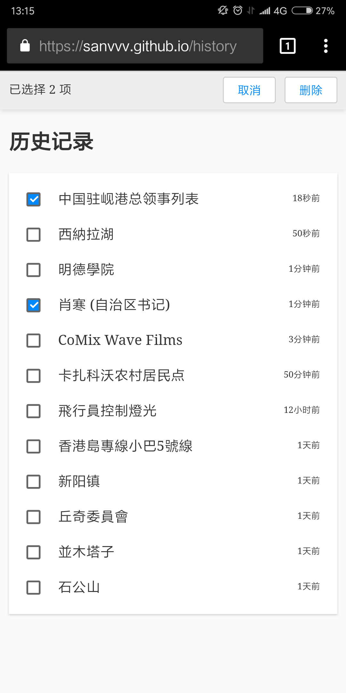

# wikipedia-react

[demo](https://sanvvv.github.io/)

基于 React 实现的维基百科应用。

由于直接使用了维基百科的 API，可能需要网络工具才能获取到条目。

## 技术栈

React 全家桶：react + redux + react-router 4.0

## Todo

- [√] 搜索
- [√] 收藏
- [√] 历史记录
- [√] 随机词条
- [√] 兼容 PC 端和移动端
- [ ] 热点推荐
- [ ] 更美观的侧栏样式和弹出动画
- [ ] 使用 TypeScript 替换 JS
- [ ] 后端代理发向维基的请求

## 截图

