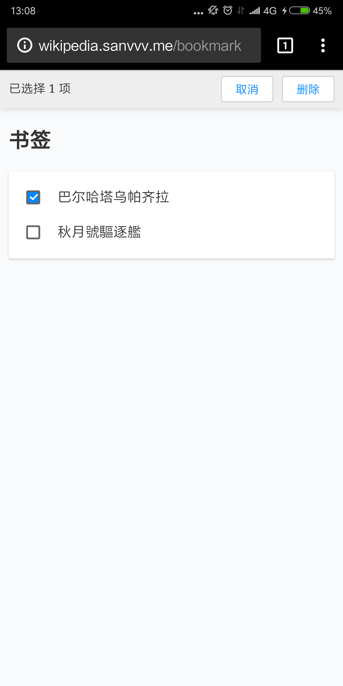

# wikipedia-react

[demo](http://wikipedia.sanvvv.me/)

基于 React 实现的维基百科应用。

由于直接使用了维基百科的 API，可能需要网络工具才能获取到条目。

## 技术栈

React 全家桶：react + redux + react-router 4.0

## Todo

- [x] 搜索
- [x] 收藏
- [x] 历史记录
- [x] 随机词条
- [x] 热榜
- [ ] 推荐及首页切换动画
- [ ] 更美观的侧栏样式和弹出动画
- [ ] 后端代理发向维基的请求
- [ ] 使用 TypeScript 替换 JS

## 截图

